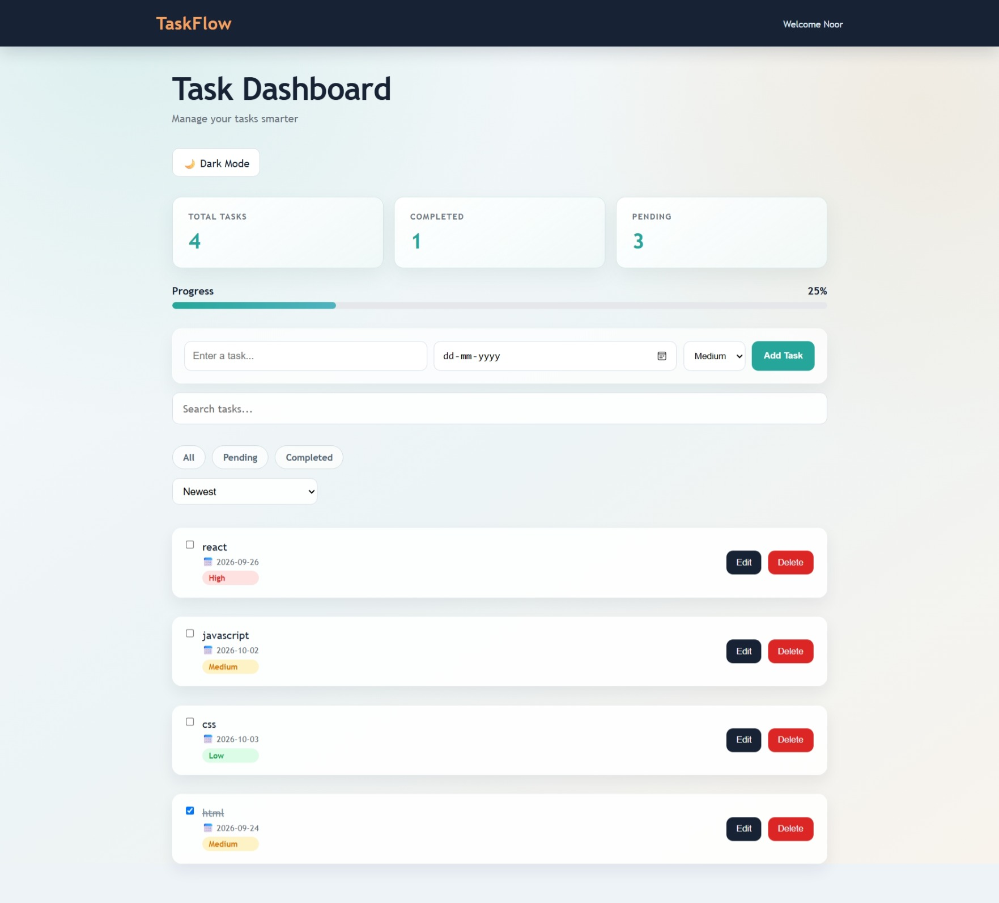

## Taskflow – React Task Management Dashboard

Taskflow is a responsive task management dashboard built with React and Vite. It allows users to create, manage, filter, sort, and track tasks through a clean and simple interface.

## Features

Add new tasks

Edit existing tasks

Delete tasks

Mark tasks as completed

Filter tasks

Sort tasks

Save tasks using Local Storage

Responsive and user-friendly dashboard

## Technologies Used

React

JavaScript

HTML

CSS

Vite

## React Concepts Used

Functional Components

Props

useState

useEffect

Event Handling

Conditional Rendering

Local Storage

Component-based architecture

 ## How to Run the Project

1. Clone the repository

## git clone https://github.com/Noorun/taskflow.git 

2. Open the project folder

## cd taskflow 

3. Install dependencies

 ## npm install 

4. Start the development server

## npm run dev 
Then open the local URL shown in the terminal.

## Project Purpose

Taskflow was created as a portfolio project to practice building a functional React application using reusable components, state management, event handling, and browser storage.

Future Improvements

User authentication

Backend integration

Database storage

Task due dates and reminders

Drag-and-drop task management⁸

## Screenshots

### Dashboard

### Task Management

